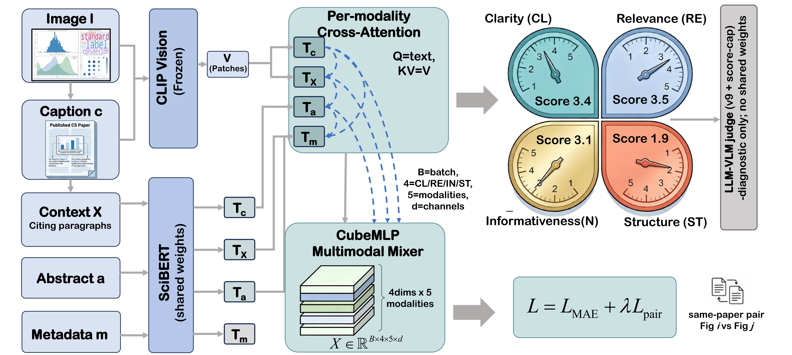

# SciFigAlign

**Scoring Scientific Figures by Fine-tuned Alignment of Visuals with Manuscript Evidence**

<p align="center">
  <a href="https://frankdengai.github.io/SciFigAlign/"></a>
  <a href="https://github.com/FrankDengAI/SciFigAlign"></a>
  
</p>

<p align="center">
  
</p>

SciFigAlign is a **manuscript-grounded benchmark and multimodal scorer** for scientific figures in peer-reviewed CS papers.
Unlike natural-image IQA or generic CLIP matching, each figure is bound to its **caption**, **citing paragraphs**, and light paper context, then scored on four peer-review dimensions:

| Dimension | Focus |
|---|---|
| **Clarity (CL)** | Print-scale legibility |
| **Relevance (RE)** | Caption / cite / narrative fit |
| **Informativeness (IN)** | Scientific content for the claim |
| **Structure (ST)** | Panel hierarchy & reading path |

## Highlights

- **Corpus:** 3,857 labeled figures from 3,126 ICLR / NeurIPS / ICML papers (test *n*=396, paper-level split)
- **Model:** Fine-tuned CLIP + SciBERT, per-modality cross-attention, CubeMLP fusion
- **Objective:** SmoothL1 regression + within-paper ranking hinge
- **Result:** MAE **0.3524**, within-paper PA **81.64%** (≈59% relative MAE reduction vs. best LLM-as-judge)

<p align="center">
  
</p>

## Project Page

**Live site:** [https://frankdengai.github.io/SciFigAlign/](https://frankdengai.github.io/SciFigAlign/)

(Enable GitHub Pages → Deploy from branch `main` / root after push.)

## Paper / Code / Data

| Asset | Status |
|---|---|
| Project page | ✅ in this repo (`index.html`) |
| Paper PDF / arXiv | ⏳ coming soon |
| Training & eval code | ⏳ coming soon |
| Checkpoints & corpus | ⏳ coming soon |

## Corpus snapshot

<p align="center">
  
</p>

## Citation

```bibtex
@article{scifigalign2026,
  title={SciFigAlign: Scoring Scientific Figures by Fine-tuned Alignment of Visuals with Manuscript Evidence},
  author={Xu, Chuanzhi and Deng, Zihan and Liang, Huiqi and Yue, Chengkun and Cui, Zhanlin and Ye, Pengfei and Cai, Weidong},
  year={2026},
  note={Preprint}
}
```

## Contact

- chuanzhi.xu@sydney.edu.au
- zhdeng@hku.hk

## License

Code and data licenses will be announced with the public release. Website content © SciFigAlign authors.
